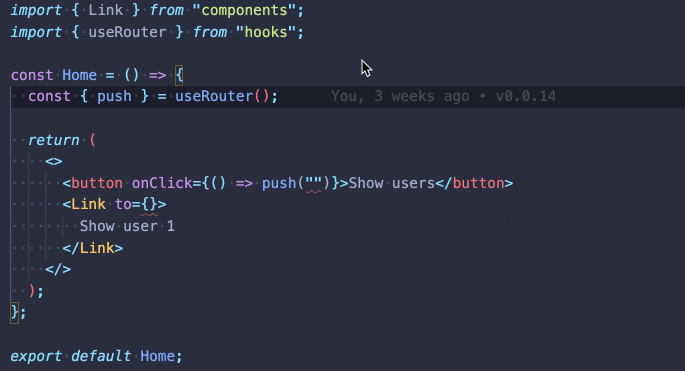
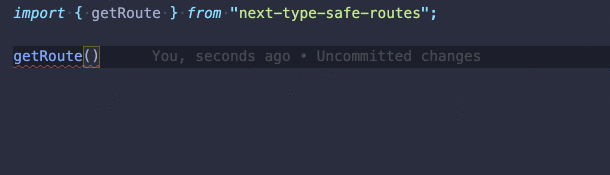

<p align="center">
  
  <h1 align="center">next-type-safe-routes</h1>
</p>

<p align="center">
  <a aria-label="NPM version" href="https://www.npmjs.com/package/next-type-safe-routes">
    
  </a>
  <a aria-label="License" href="https://github.com/ckastbjerg/next-type-safe-routes/license.md">
    
  </a>
</p>

`next-type-safe-routes` is a tiny type generation plugin for Next.js. It parses the `/pages` folder in your application and output types for all the **pages** and **API routes** in your application. These types can then be used to ensure that you only link to pages (and only use API routes) that _actually_ exists.

#### Features

- **Automatic route listing**. Avoid having to maintain a list of existing pages for your application
- **Compile time route validation**. Avoid having to run your application to verify if links are correct, just use types
- **Unopinionated**. Use our simple and composable utils our create your own implementation using the generated types



## Table of Contents

1. [Motivation](#motivation)
2. [Installation](#installation)
3. [Usage](#usage)
4. [How it works](#how-it-works)
5. [API reference](#api-reference)

## Motivation

At my company, [Proper](https://helloproper.com/), we like pages. Our self service platform is a fairly large app that currently consist of ~70 pages. And we link to those pages ~200 places in the application. We find that pages make features easily discoverable for developers and end-users alike. And having pages (urls) for each of our features help us maintain a sane information architecture.

The [Next.js file-system based router](https://nextjs.org/docs/routing/introduction) help us stay consistent and organized around our pages. However, we've had some incidents where our application was released with broken links (links to non-existing pages). One time, a file in the `/pages` folder was renamed and we simply overlooked (forgot to change) some of the links to that page. Another time, some "clever" string concatenation caused an issue. In this case, we had moved a page, and failed to update all links to the page correctly due to the concatenated links.

With the `next-type-safe-routes`, we're trying to mitigate this issue. All links in our application are now type-safe, which gives us a lot more confidence when refactoring as well as a top notch developer experience.

> We considered something like the [`next-routes`](https://github.com/fridays/next-routes) approach, but we don't want to manually have to maintain a list of routes in the application. We prefer conventions to be enforced when possible.

## Installation

Install using yarn:

```bash
yarn add next-type-safe-routes
```

Or using npm:

```bash
npm install next-type-safe-routes --save
```

## Usage

> For a detailed example setup, see the [`/example`](/example) folder

The easiest way to use `next-type-safe-routes`, is with [`next-compose-plugins`](https://github.com/cyrilwanner/next-compose-plugins). To do so, simply add a `next.config.js` file.

> See [`/example/src/next.config.js`](/example/src/next.config.js)

```js
const withPlugins = require("next-compose-plugins");
const nextTypeSafePages = require("next-type-safe-routes/plugin");

module.exports = withPlugins([nextTypeSafePages]);
```

When you start up your application, we will generate types for all of your pages and API routes and save them to the file `@types/next-type-safe-routes/index.d.ts` in the root of your project. The file will be updated whenever you add or remove pages and API routes.

> Note, you should commit this file as part of your project. And if you're using a code formatter or linter, you may want to add this file to your ignore files. E.g. `.eslintignore` and `.prettierignore` files.

You can now import the `getRoute` util from `next-type-safe-routes` and use it to retrieve a route that's is guaranteed to exist in your application.



Now you just need to decide how you want to integrate `next-type-safe-routes` in your project. If you want inspiration, we demonstrate how to create a simple abstraction for the Next.js `Link` and `router` in [the example project](/example/src).

## How it works

Since the Next.js router is based (strictly) on the file-system, we can determine which pages and API routes exists in an application simply by parsing the `/pages` folder. And due to the strictness, we can also determine which parameters are needed for dynamic routes.

As mentioned in the usage section, we generate a module declaration specific to your project when running your project. The output looks like this:

```ts
declare module "next-type-safe-routes" {
  export type TypeSafePage = ... // all your pages
  export type TypeSafeApiRoute = ... // all your routes
  export const getPathname = ... // typed based on your routes
  export const getRoute = ... // typed based on your routes
}
```

> See [`/example/src/@types/next-type-safe-routes/index.d.ts`](/example/src/@types/next-type-safe-routes/index.d.ts) for a real example

The trick here is, that we override the types for `next-type-safe-routes`. And we (re)define the args accepted by the `getRoute` and `getPathname` to match the types for your project.

The declaration will be written to `@types/next-type-safe-routes/index.d.ts` in the root (determined by Next.js) of your project.

## API reference

How you ensure that only links to existing pages is essentially up to you, but we do expose a few _tiny_ util methods to help you do this.

#### The `getRoute` method

Method that converts a type-safe route to an "actual" route:

```ts
import { getRoute } from "next-type-safe-routes";

const route = getRoute("/users"); // => '/users'
const route = getRoute({ route: "/users/[userId]", userId: 1234 }); // => '/users/1234'
```

#### The `getPathname` method

Method that just returns the pathname for a type-safe route.

```ts
const path = getPathname("/users"); // => '/users'
const path = getPathname({ route: "/users/[userId]", userId: 1234 }); // => '/users/[userId]'
```

You may not need this in you application.

#### The `TypeSafePage` and `TypeSafeApiRoute` types

These are useful for making your own abstraction. For instance, if you want to make a tiny abstraction ontop of the `next/router`:

```ts
import { TypeSafePage, getRoute } from "next-type-safe-routes";
import { useRouter as useNextRouter } from "next/router";

const useRouter = () => {
  const router = useNextRouter();

  const push = (typeSafeUrl: TypeSafePage) => {
    router.push(getRoute(typeSafeUrl));
  };

  return { ...router, push };
};

export default useRouter;
```

The type can be of the type `string` (for non-dynamic routes) or `{ route: string, >ROUTE_PARAMS< }` for dynamic routes. For instance:

```ts
export type TypeSafePage =
  | "/users"
  | { route: "/users/[userId]"; userId: string | string[] | number };
```

> Note, the `TypeSafePage` and `TypeSafeApiRoute` are kept separate even though they are essentially the same type. We do this, as you may potentially want to distinguish between them in your application.
