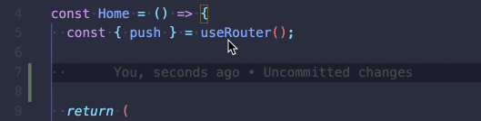

# `next-type-safe-routes` (alpha)

> **Important note!** This is work in progress. The API is prone to changes

The `next-type-safe-routes` plugin is a **type generator**. It parses the `/pages` folder in your Next.js application and generates types for all the **pages** and **API routes** in your application.

#### Features

- Ensure that you only link to **pages** that _actually_ exists
- Ensure that you only use **API routes** that _actually_ exists
- Avoid having to maintain a list of existing pages for your application
- Compile-time ("development-time") validation for all you internal page links
- Simple, composable utilities. Create the abstraction that works for your team and application.

## Table of Contents

1. [Motivation](#motivation)
2. [Installation](#installation)
3. [Usage](#usage)
4. [How it works](#how-it-works)

## Motivation

At [Proper](https://helloproper.com/), we like pages. The [Next.js file-system based router](https://nextjs.org/docs/routing/introduction) help us stay consistent and organized. And it makes our features discoverable by new developers. We maintain a fairly large Next.js app consisting of ~70 pages. And we have internal page links ~200 place in the application.

Unfortunately, we've had some incidents where our application was released with broken links (links to non-existing pages). One time, a file in the `/pages` folder was renamed and we failed in correcting all links to that page. Another time, we had been a bit _too_ clever in using string concatenation for routes.

We considered the [`next-routes`](https://github.com/fridays/next-routes) approach, but we don't want to manually have to maintain a list of routes in the application.

We now use the `next-type-safe-routes` plugin to mitigate this issue. Cause we don't wanna have to worry about breaking links to pages when refactoring our application.

## Installation

Install using yarn:

```bash
yarn add next-type-safe-routes
```

Or using npm:

```bash
npm install next-type-safe-routes --save
```

## Usage

> For a detailed example setup, see the [`/example`](/example) folder

The easiest way to use `next-type-safe-routes`, is with [`next-compose-plugins`](https://github.com/cyrilwanner/next-compose-plugins). To do so, simply add a `next.config.js` file.

> See [`/example/src/next.config.js`](/example/src/next.config.js)

```js
const withPlugins = require("next-compose-plugins");
const nextTypeSafePages = require("next-type-safe-routes/dist/plugin").default;

module.exports = withPlugins([nextTypeSafePages]);
```

You can now import the `getRoute` util, and extract a route (href) that's is guaranteed to exist in your application. 



## How it works

Since Next.js router is based (strictly) on the file-system, we can easily determine which pages and API routes exists in your application. And we can determine which query parameters are needed in order to link to a dynamic route.

When you run your application, we generate a module declaration specific to your project:

> See [`/example/src/@types/next-type-safe-routes/index.d.ts`](/example/src/@types/next-type-safe-routes/index.d.ts)

```ts
declare module "next-type-safe-routes" {
  export type TypeSafePage = ... // all your pages
  export type TypeSafeApiRoute = ... // all your routes
  export const getPathname = ... // typed based on your routes
  export const getRoute = ... // typed based on your routes
}
```

The declaration will be written to `@types/next-type-safe-routes/index.d.ts` in the root (determined by Next.js) of your project. You will most likely want to commit this file as part of your project.

#### The `TypeSafePage` and `TypeSafeApiRoute` types

These can either be of the type `string` (for non-dynamic routes) or `{ route: string, [...params] }` for dynamic routes:

For instance:

```ts
export type TypeSafePage =
  | "/users"
  | { route: "/users/[userId]"; userId: string | string[] | number };
```

> Note, the `TypeSafePage` and `TypeSafeApiRoute` are kept separate even though they are essentially the same type. We do this, as you may potentially want to distinguish between them in your application.

How you ensure that only links to existing pages is essentially up to you, but we do expose a few _tiny_ util methods to help you do this.

#### The `getPathname` method

Super tiny method that just returns the pathname.

```ts
const path = getPathname("/users"); // => '/users'
const path = getPathname({ route: "/users/[userId]", userId: 1234 }); // => '/users/[userId]'
```

You may not need this in you application.

#### The `getRoute` method

Tiny util that converts a `next-type-safe-routes` route to an "actual" route:

```ts
import { getRoute } from "next-type-safe-routes";

const route = getRoute("/users"); // => '/users'
const route = getRoute({ route: "/users/[userId]", userId: 1234 }); // => '/users/1234'
```

> Note, that this is a very small util method. You can totally write it yourself if prefered...
